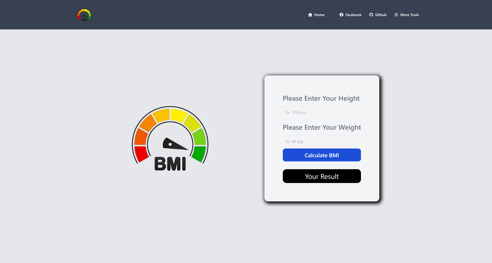

# 🏋️‍♂️ BMI Calculator

A **simple** BMI calculator built with **HTML**, **CSS**, **JavaScript**, and **Tailwind CSS**.

---

## 🌐 Live Demo

👉 [https://abdul-bmi-calculator.netlify.app/](https://abdul-bmi-calculator.netlify.app/)

---
# BMI Calculator

...

## Website Demo

**Desktop View:**



**Mobile View:**

.png)

...


## ✨ Features

- Responsive design using **Tailwind CSS**  
- Calculates BMI based on **height** and **weight**  
- Shows BMI category with **color-coded backgrounds**  
- Mobile-friendly **navigation menu**

---

## 🚀 Installation

1. **Clone the repository:**
   ```bash
   git clone https://github.com/abdul-korim-web/bmi-calculator.git
cd bmi-calculator
npm install
npm run dev
## ⚙️ Usage
Open http://localhost:3000 in your browser to run the app locally.
## 🚀👤 Author
👉 GitHub: [abdul-korim-web](https://github.com/abdul-korim-web) <br>
👉 Facebook: [abdul-korim-web](https://www.facebook.com/abdulkorimweb) <br>
👉 LinkedIn: [abdul-korim-web](https://www.linkedin.com/in/abdul-korim-web/) <br>
